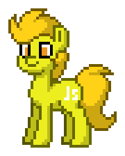
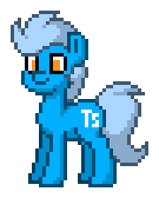
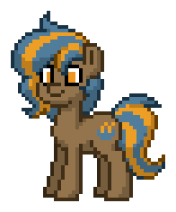
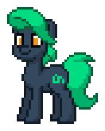

  <h1>Pony Logos</h1>
  
The "ponify" logo based on <a href="https://pony.town">pony.town</a>

## Gallery

<table style="text-align: center">
  <tr>
    <td></td>
    <td></td>
    <td></td>
    <td></td>
  </tr>
  <tr>
    <td>Vue</td>
    <td>JavaScript</td>
    <td>TypeScript</td>
    <td>Python</td>
  </tr>
  <tr>
    <td></td>
    <td></td>
    <td></td>
    <td></td>
  </tr>
  <tr>
    <td>VSCode</td>
    <td>GitHub</td>
    <td>Java</td>
    <td>ElysiaJS</td>
  </tr>
  <tr>
    <td></td>
    <td></td>
    <td></td>
    <td></td>
  </tr>
  <tr>
    <td>Nuxt</td>
    <td>Nodejs</td>
    <td>Kotlin</td>
    <td>React</td>
  </tr>
</table>

## How to import the config file?

Please refer to this video, and you can download the .ptc file and export more animation

[Click here to jump to YouTube](https://www.youtube.com/watch?v=t2K1e2JJ1T0)